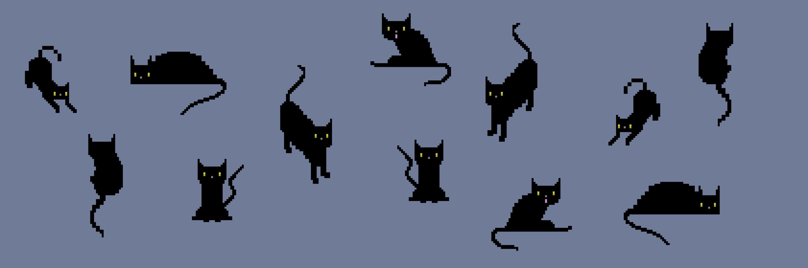

# Hi there, I'm Praneeth Reddy 

## 🐱 About Me
I'm a Software Developer and DevOps Engineer specializing in building scalable backend architectures and robust cloud infrastructure. My work heavily revolves around distributed systems, network simulation, and developing efficient orchestration tools using Go, Python, and Docker. I'm deeply passionate about automating infrastructure, optimizing networking pipelines, and tackling complex architectural challenges. When I'm not deploying clusters, you can find me hanging out with my cat 🐾.

---

## 🚀 Dashboard & Metrics

<table align="center">
  <tr>
    <td align="center" width="50%">
      <strong>GitHub Stats</strong>  
      
    </td>
    <td align="center" width="50%">
      <strong>Top Languages</strong>  
      
    </td>
  </tr>
  <tr>
    <td align="center" width="50%">
      <strong>Contribution Streak</strong>  
      
    </td>
    <td align="center" width="50%">
      <strong>Activity Graph</strong>  
      
    </td>
  </tr>
</table>

---

## 🛠️ Tech Stack

**Languages**  

  
  
  
  
  
  

**Frameworks & Backend**  

  
  
  
  
  

**Infrastructure & DevOps**  

  
  
  
  
  

**Databases**  

  
  
  
  

---

## 🐾 Cat-tastic Fun Facts

<table align="center" border="0" style="border: none;">
  <tr style="border: none;">
    <td align="center" width="50%" style="border: none;">
      <i>Did you know? Cats sleep for about 16 hours a day to recharge their "batteries" just like I recharge my brain with coffee and coding!</i>  
      
    </td>
    <td align="center" width="50%" style="border: none;">
      <i>I love to code as much as my cat loves to nap! And that's a lot! 😸</i>    
      
    </td>
  </tr>
</table>

---

## 📫 How to Reach Me

  
Let's connect and talk about tech, distributed systems, cats, or anything in between!

  
  
  

