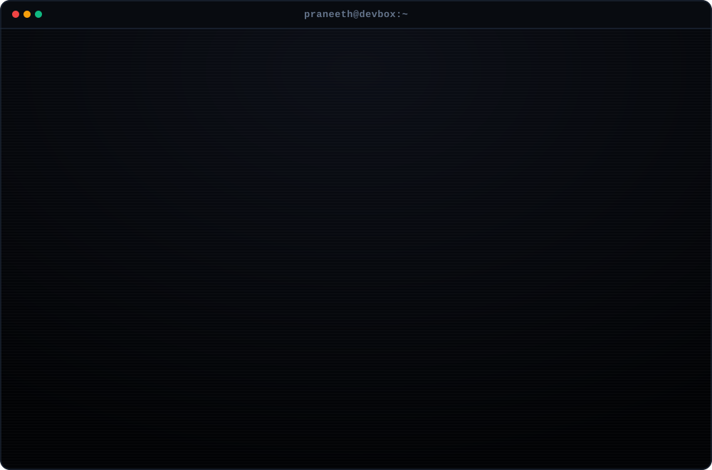
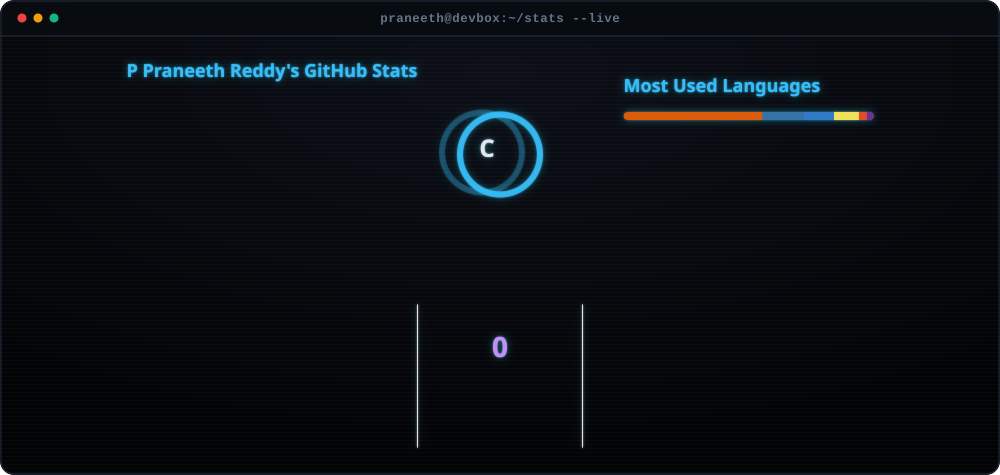

  <!-- RETRO PHOSPHOR TERMINAL HEADER -->
  <a href="https://github.com/PraneethReddy-github">
    <picture>
      <source media="(prefers-color-scheme: dark)" srcset="./assets/svg/dark.svg">
      <source media="(prefers-color-scheme: light)" srcset="./assets/svg/light.svg">
      
    </picture>
  </a>

  <!-- RETRO TERMINAL THEMED LIVE GITHUB STATS FRAME -->
  

  <!-- LIVE VISITOR PING (1px, invisible).
       This is what actually increments the counter: komarev only counts a hit
       when GitHub's camo image proxy requests it, i.e. on a real profile view.
       The glowing panel below renders that same total, refreshed by CI.
       Removing this line freezes the counter at its current value. -->
  

  <!-- CYBER CAT EYES GIF -->
  

  <!-- GLOWING VISITOR COUNTER (total refreshed every 6h by CI) -->
  

  <!-- Prefer a number that updates instantly instead of every 6h? Swap the
       block above for this live badge (it counts and displays in one shot):
  
  -->

